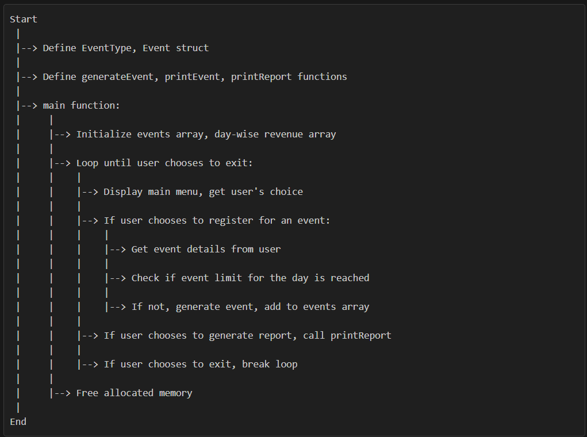

# Event Management System

This system allows users to register for events and generate a consolidated report of all events.

## Workflow

1. Define `EventType` enum and `Event` struct.
2. Define `generateEvent`, `printEvent`, `printReport` functions.
3. In the `main` function:
   - Initialize the 2D array of events and the day-wise revenue array.
   - Enter a loop that continues until the user chooses to exit.
     - Display the main menu and get the user's choice.
     - If the user chooses to register for an event:
       - Get the day, event type, number of participants, and revenue from the user.
       - Check if the limit of events per day is reached.
       - If not, generate the event and add it to the events array.
     - If the user chooses to generate the consolidated report, call the `printReport` function.
     - If the user chooses to exit, break the loop.
   - Free the allocated memory for the events array and the day-wise revenue array.

